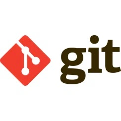

# **Инструкия по работе с Git**

**Коротко о Git**

_Git  — распределённая система управления версиями. Проект был создан Линусом Торвальдсом для управления разработкой ядра Linux_

## **Создание нового локального репозитория**

Команда для созданиянового локального репозитория

    git init

## **Проверка статуса репозитоия**

Команда для проверки статуса репозитория
    
    git status

## **Добавление файлов в репозиторий**

Команда добавления нового или изменённого файла в репозиторий

    git add .\ <имя_файла который лежит в папке репозитория>

Команда добавления всех файлов в папке в репозиторий

    git add .

## **Фиксирование изменений в репозитории с комментарием**

Команда для фиксирования изменений в репозитории (добавлять комментарий придётся через редактирование файла)

    git commit

Команда для фиксирования изменений в репозитории с флагом -m

    git commit -m "<сообщение об изменениях в файле>"

Команда для фиксирования изменений в репозитории с флагом -a (добавление комментария так же через редактирование файла в терминале)

    git commit -a

Команда для фиксирования изменений в репозитории совмещенная с добавлением файла

    git commit -am <сообщение, описывающее изменение>

## **Вывод списка изменений в репозитории**

Команда для вывода изменений репозитория с хэшами состояний (список коммитов)

    git log

Команда для вывода изменений репозитория в упрощённом (более удобном для чтения) виде

    git log --oneline

Команда для вывода всех изменений репозитория, если мы перемещались между коммитами и остановились не на последнем покажет все коммиты (даже те, чт ов будущем с точки зрения активного коммита)

    git log --all

Команда для вывода всех коммитов (если активным выбране не последний), но в компактном виде

    git log --all --oneline

## **Сравнение коммитов**

Команда для оборажения разницы между последним и предпоследним коммитом

    git diff

Команда для отображения разницы между последним коммитом и другим коммитом <указать_хэш_коммита>

    git diff <hash>

Команда для отображения изменений между коммитами <хэш_коммита1> <хэш_коммита2>

    git diff <hash1> <hash2>

## **Перемещенме между коммитами**

Команда для переключения на другой коммит <хэш_коммита> (делаем коммита активным - последним)

    git checkout <hash>

Команда для переключения на последний по хронологии коммит (возврат к мастеру)

    git checkout master

## **Ветвления**

Ветвелния в git нужны, чтобы иметь возможноть одновременно разрабатывать несколько параллельных функций.

## **Новая ветка**

Для создания новой ветки используется команада:

    git branch <branch_name>

## **Просмотр всех веток**

Для просмотра всех веток используем команду:

    git branch

